JavaWeb

# 一、JavaEE规范

JavaEE(Java Enterprise Edition)：Java企业版

- 由SUN公司领导，各个厂家共同制定并得到广泛认可的工业标准
- 早期叫做J2EE，但是没有继续采用其命名规则。J2EE的版本从1.0开始到1.4结束，而JavaEE版本是从JavaEE5版本开始的。
- 是很多Java开发技术的总称，这些技术规范都是沿用J2EE的，一共包括了13个技术规范：==JDBC==,JNDI,==EJB==,RMI,IDL/CORBA,==JSP,Servlet，XML==,JMS,JTA,==JavaMail==，JAF。

# 二、WEB概述

web——网络——获取资源——网站

web资源：

- 动态资源：**需要==特定的web服务器==才可以运行的组件。**如：Servlet，JSP,ASP,PHP
- 静态资源：html,CSS,JS,VUE...

# 三、系统结构

## 1、基础结构：

- CS结构
- BS结构
[[../../../500-爱好&兴趣/Excalidraw/常见的两种软件架构]]
  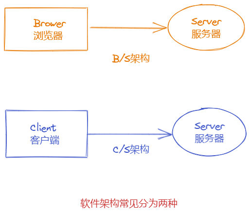
###  1.1 两种结构的区别
- 第一：硬件环境不同，C/S通常是建立在专用的网络或小范围的网络环境上（即局域网），且必须要安装客户端。而B/S是建立在广域网上的，适应范围强，通常有操作系统和浏览器就行。

- 第二：C/S结构比B/S结构更安全，因为用户群相对固定，对信息的保护更强。

- 第三：B/S结构维护升级比较简单，而C/S结构维护升级相对困难。

### 1.2  两种结构的优缺点

 1. C/S：是能充分发挥客户端PC的处理能力，很多工作可以在客户端处理后再提交给服务器。对应的优点就是客户端响应速度快。


 2.  B/S：总体拥有成本低、维护方便、 分布性强、开发简单，可以不用安装任何专门的软件就能 实现在任何地方进行操作，客户端零维护，系统的扩展非常容易，只要有一台能上网的电脑就能使用。

### 1.3【补充】CS架构：

客户端：连接服务器做操作

客户端的分类：

- 命令行客户端：即黑窗口，一般提供给运维人员使用；
- 图形化客户端：程序员或者非运维人员使用；
- ==程序客户端：专门给程序员使用。可以用来操作服务器。==

【示例】MySQL：典型的CS架构

- 命令行客户端：

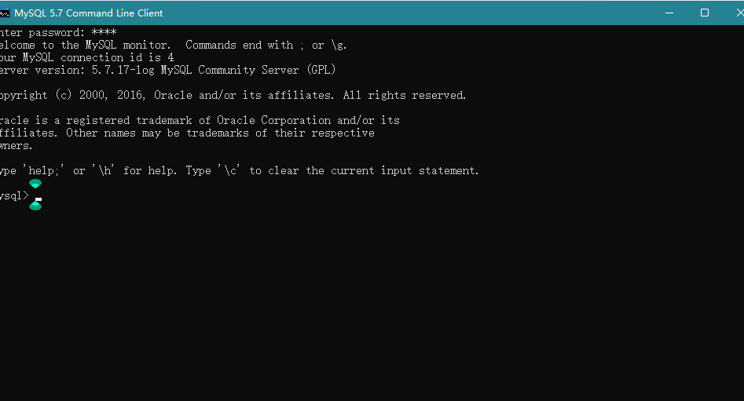

- 图形化客户端：Navicat、SQLyog等

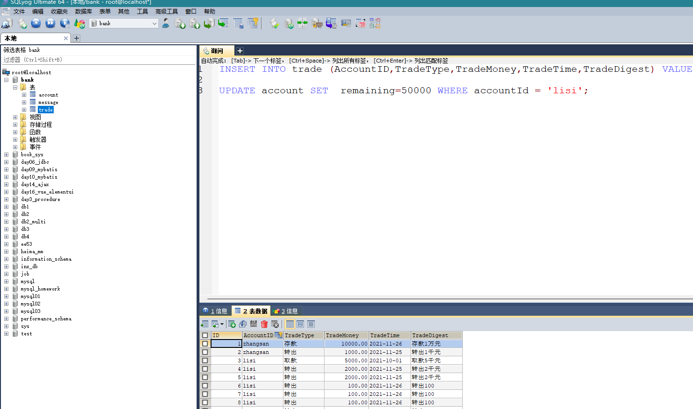

- ==程序客户端==：表现形式就是项目中引入的==依赖/jar包==


> ==所以为什么要引入依赖，因为它是操作程序的客户端。==

## 2、技术选型：

- mvc模型
- 三层架构+MVC模型
- ...

## 3、部署方式：

- 单体架构
- 垂直拆分架构
- 分布式架构
- 微服务架构
- ...详见dubbo笔记 [架构演进过程](../../分布式/Dubbo/Dubbo.md)

# 四、 服务器
## 1、服务器介绍
- 服务器是计算机的一种，它比普通计算机运行更快，负载更高、价格更贵。
- 服务器在网络中为其它客户机（如PC机、智能设备等）提供计算或者应用服务。
- 服务器具有高速的CPU运算能力、长时间的可靠运行、强大的IO外部数据吞吐能力以及更好的扩展性。

## 2、Web服务器
- 本质上是一款软件，通过和硬件的相结合，从而达到发布应用的功能，用户可以通过客户端或者浏览器访问我们的应用。


- 常见的web服务器：

| 服务器名称  | 说明                                                |
|:----------- |:--------------------------------------------------- |
| weblogic    | 实现了JavaEE规范，重量级服务器，又称为JaveEE容器    |
| websphereAS | 实现了JavaEE规范，重量级服务器                      |
| JBOSSAS     | 实现了JavaEE规范，重量级服务器，免费的              |
| Tomcat      | 实现了jsp/servlet规范，是一个轻量级服务器，开源免费 |


# 五、Tomcat服务器
## 1、Tomcat基础
### 1.1 Tomcat是什么？

Tomcat是一个免费开源的轻量级Web应用服务器。其本质就是一个软件，或者应用。作用是发布我们的项目，让用户可以通过浏览器访问我们的应用。

轻量级：组件对其环境的依赖程度小

### 1.2 Tomcat解决什么问题？

解决了web应用的部署问题，能够让用户通过浏览器访问到我们开发的应用。

**部署**：将web应用程序（第三方war或者自己的web应用程序）安装到Tomcat服务器的过程。

web应用由多个静态web资源和动态web资源组成，例如：html、css、js文件，jsp文件、java程序、支持jar包、工程配置文件、图片、音视频等等。

Web应用开发好后，若想供外界访问，需要把web应用所在目录交给Web服务器管理（Tomcat就是Web服务器之一），这个过程称之为虚似目录的映射。

### 1.3 Tomcat怎么使用？

- windows系统下启动与关闭

  - 目录
  
    
  
  - 启动
  	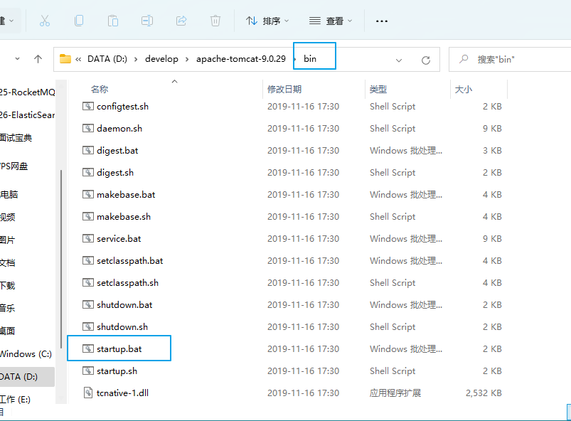

  - 关闭

  ```txt
  1 直接点击X号，暴力关闭，实际开发不推荐
  2 在黑窗口中执行ctrl+c
  3 双击bin目录下的shutdown.bat
  ```

- linux系统下启动与关闭
```shell
1、上传linux版本的tomcat安装包

2、 解压安装包到/usr/local/tomcat目录中
cd /usr/local
mkdir tomcat
cd ~
tar -xzvf apache-tomcat-9.0.29.tar.gz -C /usr/local/tomcat

3、 启动
cd /usr/local/tomcat/apache-tomcat-9.0.29/bin
./startup.sh

4、访问(前提要关闭防火墙)
http://虚拟机的IP:8080

5、 关闭
./shutdown.sh


***发布项目，直接将项目文件夹放置到webapps目录下即可
cd /usr/local/nginx
cp -r web/ /usr/local/tomcat/apache-tomcat-9.0.29/webapps

重启服务器即可
```

- 集成到idea
  - 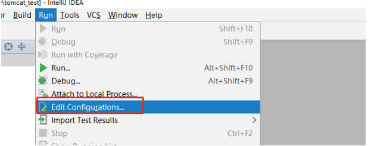
  - 
  - 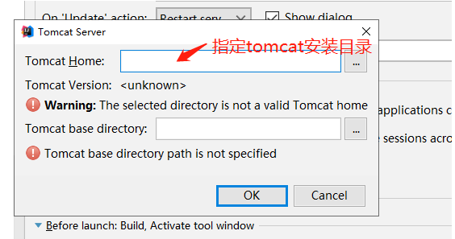
  - 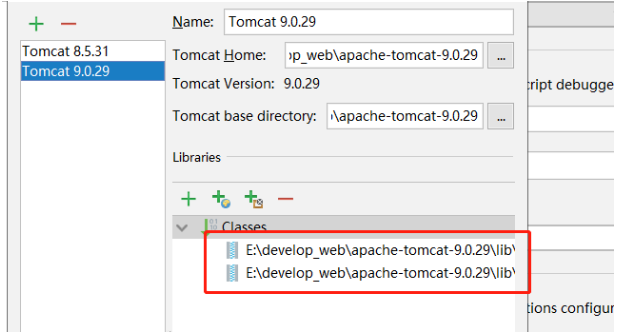

【总结】tomcat启动时出现的问题：

```java

第一类问题：jdk的环境变量没有配置正确
	现象：双击启动程序，黑窗口一闪而过
	排查：检查环境变量中的JAVA_HOME配置是否正确
	解决：正确配置JAVA_HOME即可；配置的路径是不包含bin目录的
	
//第二类问题：端口占用问题
	现象：启动时，会报错；Address already in use
	解决：找到占用指定端口（8080）的程序，干掉他
		//在黑窗口中使用一下命令找到指定端口对应的进程号
		netstat -ano|find "8080"

第三类问题：核心配置文件出现配置错误
	现象：黑窗口一闪而过；不是jdk配置问题
	排查：查看logs目录下的日志文件，定位错误
	
```


### 1.4 【Tomcat的部署方式】
#### 1.4.1 介绍

1. **静态部署：**直接拷贝相应的web展开目录、或者war包。（展开目录的意思就是tomcat可以直接访问的应用目录，是未经过压缩的。相反的就是war包，是一种经过压缩的web应用文件）。

2. **动态部署：**通过tomcat管理器或者其他工具（如TCD，tomcat client deployer）执行部署。

   如果是使用静态部署，或者使用tomcat管理器进行部署是不需要安装任何东西的。
   
   ​		但是如果要使用TCD进行部署，那么就需要预先安装JDK和Ant，因为TCD中内置的是Ant的任务构建脚本；然后再下载TCD的部署包。
   
   ​		另外，还需要了解一个概念——上下文，Context。在tomcat中，上下文就是一个web应用。在之前的tomcat版本中，上下文信息是配置在server.xml中的，现在仍然可以，但是官方并不推荐这种做法。

​		上下文路径主要在：

　　1  CATALINA_HOME/conf/容器名字/主机名字/应用名字.xml

　　2  CATALINA_HOME/webapps/应用名字/META-INF/context.xml

​		其中路径1中：容器名字（enginename）通常为Catalina、主机名字为localhost。相关内容可以查看server.xml中：

​		

#### 1.4.2 静态部署——在tomcat启动时部署

​		部署时，涉及到一个变量appBase。这个变量标识了一个目录，该目录存放着部署的web应用。

　　一般默认情况下，appBase为CATALINA_HOME/webapps，配置信息位于server.xml中。	

​		appBase指定了部署的目录；

　　autoDeploy设置是否自动部署（下小节动态部署中会介绍）；

　　unpackWARs设置了部署的形式，如果为true，则会以展开的形式部署；如果为false，则会以war包的形式部署。

​		设置了以上的内容后（以上都是tomcat默认的配置，不需要做任何改动），当启动tomcat时，就会自动部署在appBase目录下的应用。

　　并会按照下面的顺序进行部署：

　　1 部署上下文描述符。

　　2 部署展开的应用。如果部署目录中存在相应的war包，则检查是否比当前的应用更新；如果更新，则删除当前的应用，并解压该war包，得到最新的应用。

　　3 部署war包。

#### 1.4.3 动态部署——在tomcat运行时部署

​		动态部署需要一个配置参数，就是上面提到的 autoDeploy 为 true。

　　当设置了该属性后，tomcat会在其运行时支持如下的操作：

　　1 部署新拷贝到appBase下的war文件

　　2 部署拷贝到appBase下的展开的应用（未压缩的）

　　3 当提供一个更新的war包时，重新部署应用。会先删除当前存在的应用，再进行解压部署。

　　4 当/WEB-INF/web.xml被改写时，自动部署

　　5 当web应用的context.xml上下文描述符被更新时，自动部署

　　6 当CATALINA_HOME/conf下对应的应用的上下文描述符被更新时，自动部署

　　7 当对应的docBase文档被删除时，自动部署。

#### 1.4.4  使用TCD客户端程序部署

​		TCD即tomcat客户端部署工具，它使用了Ant的构建脚本，因此需要具有一定Ant的知识。

　　**使用过程如下：**

　　首先，需要安装Ant以及JDK。配置ANT_HOME和JAVA_HOME。

　　然后，下载TCD部署包。一般我们使用的时候下载的是上面的核心包，如果想要使用TCD则需要下载下面的部署包。

​		

​		下载后在任意位置解压：

​		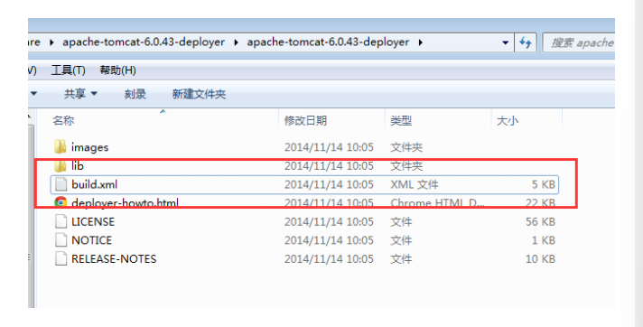

​		可以看到目录中包含一个build.xml，TCD的相关任务内容就配置在这里面。

　　下面看看这个构建脚本都包括什么任务：

1. 编译：

   编译和校验应用。这部分功能可以独立使用，并且不需要运行中的tomcat。经过编译的应用只能与相应版本的tomcat相关联，不能保证在其他版本的容器中也能使用，这是因为编译生成的代码与运行的组件有关系。需要注意的是，这个任务也会自动编译在/WEB-INF/classes目录下的类。

   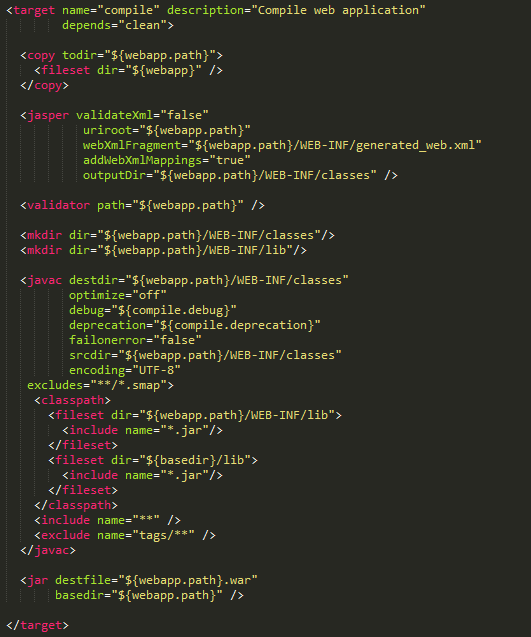

2. 部署：在tomcat容器中部署应用

3. 解除部署：解除应用的部署

4. 开始：开始web应用

5. 重新加载：重新加载web应用

6. 停止：停止web应用

   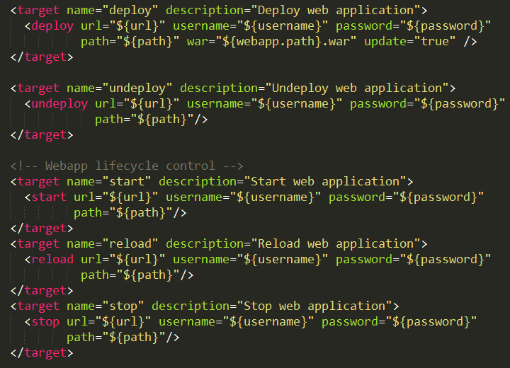

   另外可以在deployer.properties中配置TCD相关的部署信息，并且按照键值对的形式配置。

   　　主要包括以下的内容：

   1. build：构建目录，默认是{path}。在编译任务结束后，编译的结果将会保存为{path}.war
   2. webapp：这个目录包含了将被编译和校验的展开应用。默认为myapp
   3. path：应用的部署上下文路径，默认是/webapp
   4. url：tomcat容器中管理器应用的绝对地址，改地址将会用于部署和解除部署应用。默认，部署会尝试进入默认的Locahost实例，即http://localhost:8080/manager
   5. username：tomcat管理器的用户名
   6. password： tomcat管理器的用户密码

   需要注意的是tomcat管理器的授权问题，如果不能正常使用管理器，该部署也会失败。

   ​		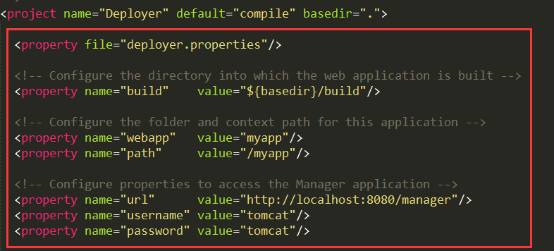

#### 1.4.5 使用Manager App控制台部署

​		在tomcat主页点击“Manager App” 进入应用管理控制台，可以指定一个web应用的路径或war文件。

#### 1.4.6 详细步骤

- ==**直接将项目的war包放置到webapps目录中即可（工作中使用）**==

```shell
//在项目的目录下，执行以下命令打war包（后续不会这样做）
jar -cvf aa.war .

//将生成的aa.war放置到webapps目录中

//启动tomcat服务器，会自动将aa.war包解压成aa文件夹
器中aa文件夹就是当前这个项目的访问路径

//访问aa下的资源
http://localhost:8080/aa/index.html
```

- **修改核心配置文件，配置项目的虚拟访问路径（不推荐）**


​		访问资源：http://localhost:8080/bb/index.html

- **在conf/Catalina/localhost目录中添加一个xml文件，配置虚拟访问路径（idea使用的方式）**


​		访问资源：http://localhost:8080/cc/index.html

## 2、【Tomcat高级】
视频：https://www.bilibili.com/video/BV1dJ411N7Um?p=2
```md
什么是Tomcat Connector运行模式？


Tomcat如何创建Servlet类实例？原理是什么？


Tomcat顶层架构


Tomcat工作模式


什么是Container？


Connector和Container的关系


Container架构分析


Container如何处理请求？
```

# 六、HTTP协议
## 1、介绍
- HTTP(Hyper Text Transfer Protocol) 超文本传输协议：是一种用于分布式、协作式的应用层协议。

- HTTP协议是基于[TCP/IP协议]来传递数据(HTML文件、图片文件、查询结果等)。

- 超文本：比普通文本更强大

- 传输协议：客户端和服务端的通信规则(握手规则)

  

> 注意：JS、CSS、图片资源会自动发起请求

### 1.1 四层经典的网络模型
- 应用层：http：基于tcp/ip协议封装成的应用层协议
- 传输层：
	- tcp：面向连接的安全协议
	- udp：面向无连接的不安全协议
- 网络层：ip
- 数据链路层
## 2、HTTP工作原理

HTTP协议工作于客户端-服务端架构上。浏览器作为HTTP客户端通过URL向HTTP服务端即WEB服务器发送所有请求。

Web服务器有：Apache服务器，IIS服务器（Internet Information Services）等。

Web服务器根据接收到的请求后，向客户端发送响应信息。

HTTP默认端口号为80，但是你也可以改为8080或者其他端口。

- **HTTP三点注意事项：**

  - **HTTP是无连接：**无连接的含义是限制每次连接只处理一个请求。服务器处理完客户的请求，并收到客户的应答后，即断开连接。采用这种方式可以节省传输时间。

  - **HTTP是媒体独立的：**这意味着，只要客户端和服务器知道如何处理的数据内容，任何类型的数据都可以通过HTTP发送。客户端以及服务器指定使用适合的MIME-type内容类型。

    MIME-type(*Multipurpose Internet Mail Extensions*) 是描述消息内容类型的因特网标准。

    MIME 消息能包含文本、图像、音频、视频以及其他应用程序专用的数据。
    
    [MIME-type] https://www.w3school.com.cn/media/media_mimeref.asp
    
  - **HTTP是无状态：**HTTP协议是无状态协议。无状态是指协议对于事务处理没有记忆能力。缺少状态意味着如果后续处理需要前面的信息，则它必须重传，这样可能导致每次连接传送的数据量增大。另一方面，在服务器不需要先前信息时它的应答就较快。`HTTP`协议本身不会对发送过的请求和相应的通信状态进行持久化处理。这样做的目的是为了保持`HTTP`协议的简单性，从而能够快速处理大量的事务, 提高效率。
  - 然而，在许多应用场景中，我们需要保持用户登录的状态或记录用户购物车中的商品。由于`HTTP`是无状态协议，所以必须引入一些技术来记录管理状态，例如`Cookie`。
  
  HTTP协议通信流程：

  
  ​	[CGI]（Common Gateway Interface）[公共网关接口]，是外部扩展应用程序与 Web 服务器交互的一个标准接口。
## 3、HTTP消息结构
HTTP是基于客户端/服务端（C/S）的架构模型，通过一个可靠的链接来交换信息，是一个无状态的请求/响应协议。

一个HTTP"客户端"是一个应用程序（Web浏览器或其他任何客户端），通过连接到服务器达到向服务器发送一个或多个HTTP的请求的目的。

一个HTTP"服务器"同样也是一个应用程序（通常是一个Web服务，如Apache Web服务器或IIS服务器等），通过接收客户端的请求并向客户端发送HTTP响应数据。

HTTP使用统一资源标识符（Uniform Resource Identifiers, URI）来传输数据和建立连接。

一旦建立连接后，数据消息就通过类似Internet邮件所使用的格式[RFC5322]和多用途Internet邮件扩展（MIME）[RFC2045]来传送。
==访问资源的路径写法==
```md
服务器路径 + 项目路径 + 资源路径

服务器路径（查找指定服务器）：http://localhost:8080
项目路径（查找指定服务器下的项目）： /aa
资源路径（查找项目下的指定资源）： /a.txt

最终写法：http://localhost:8080/aa/a.txt

```

### 3.1 客户端请求消息
客户端发送一个HTTP请求到服务器的请求消息包括以下格式：==请求行（request line）、请求头部（header）、空行和请求数据四个部分组成==，下图给出了请求报文的一般格式。


```md
请求行:
	- 格式： 请求方式 请求url 协议/版本
	- 例子：
		 - POST: http://localhost:8080/aa.html?username=zhangsan&pwd=123
请求头:针对这次请求的一些额外描述，可以不停扩充，从而让http协议不断适应现在互联网的环境变化。
	- 格式：key:value1,value2,value3,...
	- 例子：
		Connection: keep-alive
		Accept-Encoding: gzip, deflate, br
		
	***特殊含义的请求头：
		user-agent -- 携带发送请求的浏览器的版本信息
		if-modified-since -- 携带资源的过期时间
		if-none-match -- 携带资源的唯一标识符

请求空行:
	请求头和请求体的分隔符

请求体:
	-  get请求有请求体，只是没有数据
   - post请求体是请求的参数信息，格式：name=value&name2=value2
	
	例子：username=zhangsan&pwd=123

```
### 3.2 服务器响应消息
HTTP响应也由四个部分组成，分别是：状态行、消息报头、空行和响应正文。
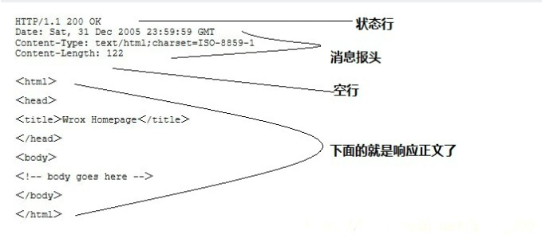

```md
响应行
	- 格式：协议/版本 状态码 [状态描述]
	- 例子：HTTP/1.1 200 
	
	***常见状态码：
		200 请求完整资源成功
		206 请求部分资源成功（了解）
		302 资源重定向
		304 缓存
		404 资源找不到（路径写错了）
		500 服务器报异常
		
响应头（针对这次响应需要携带的额外信息，可以扩展的）
	格式：key:value1,value2,value3,...
	例子：Connection: keep-alive
	
	***特定含义的响应头：
		refresh  定时刷新
		location 重定向跳转的资源路径
		last-modified  设置资源的过期时间
		etag  设置资源的唯一标识
		content-type 设置响应资源的类型及码表
		
响应空行
	分割响应头和响应体
	
响应体
	服务器写回到浏览器的正文部分

```

### 3.3 HTTP请求方法
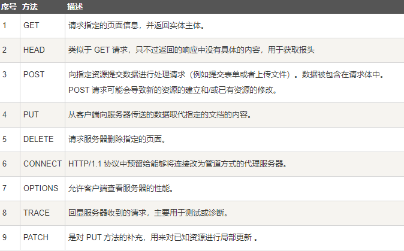
注意：GET、POST、PUT、DELETE本质上没有区别，根据restful风格，只是程序员定义的。底层都是基于TCP协议进行数据传输。

### 3.4 HTTP状态码分类
HTTP状态码由三个十进制数字组成，第一个十进制数字定义了状态码的类型，后两个数字没有分类的作用。HTTP状态码共分为5种类型：

| 分类 | 分类描述 |
| ---- | -------- |
|   1**   |   信息，服务器收到请求，需要请求者继续执行操作       |
|   2**   |   成功，操作被成功接收并处理       |
|   3**   |   重定向，需要进一步的操作以完成请求       |
|   4**   |   客户端错误，请求包含语法错误或无法完成请求       |
|   5**   |   服务器错误，服务器在处理请求的过程中发生了错误       |

HTTP状态码列表：

| 状态码 | 状态码英文名称                  | 中文描述                                                                                                                                                         |
| ------ | ------------------------------- | ---------------------------------------------------------------------------------------------------------------------------------------------------------------- |
| 100    | Continue                        | 继续。客户端应继续其请求                                                                                                                                         |
| 101    | Switching Protocols             | 切换协议。服务器根据客户端的请求切换协议。只能切换到更高级的协议，例如，切换到HTTP的新版本协议                                                                   |
| 200    | OK                              | 请求成功。一般用于GET与POST请求                                                                                                                                  |
| 201    | Created                         | 已创建。成功请求并创建了新的资源                                                                                                                                 |
| 202    | Accepted                        | 已接受。已经接受请求，但未处理完成                                                                                                                               |
| 203    | Non-Authoritative Information   | 非授权信息。请求成功。但返回的meta信息不在原始的服务器，而是一个副本                                                                                             |
| 204    | No Content                      | 无内容。服务器成功处理，但未返回内容。在未更新网页的情况下，可确保浏览器继续显示当前文档                                                                         |
| 205    | Reset Content                   | 重置内容。服务器处理成功，用户终端（例如：浏览器）应重置文档视图。可通过此返回码清除浏览器的表单域                                                               |
| 206    | Partial Content                 | 部分内容。服务器成功处理了部分GET请求                                                                                                                            |
| 300    | Multiple Choices                | 多种选择。请求的资源可包括多个位置，相应可返回一个资源特征与地址的列表用于用户终端（例如：浏览器）选择                                                           |
| 301    | Moved Permanently               | 永久移动。请求的资源已被永久的移动到新URI，返回信息会包括新的URI，浏览器会自动定向到新URI。今后任何新的请求都应使用新的URI代替                                   |
| 302    | Found                           | 临时移动。与301类似。但资源只是临时被移动。客户端应继续使用原有URI                                                                                               |
| 303    | See Other                       | 查看其它地址。与301类似。使用GET和POST请求查看                                                                                                                   |
| 304    | Not Modified                    | 未修改。所请求的资源未修改，服务器返回此状态码时，不会返回任何资源。客户端通常会缓存访问过的资源，通过提供一个头信息指出客户端希望只返回在指定日期之后修改的资源 |
| 305    | Use Proxy                       | 使用代理。所请求的资源必须通过代理访问                                                                                                                           |
| 306    | Unused                          | 已经被废弃的HTTP状态码                                                                                                                                           |
| 307    | Temporary Redirect              | 临时重定向。与302类似。使用GET请求重定向                                                                                                                         |
| 400    | Bad Request                     | 客户端请求的语法错误，服务器无法理解                                                                                                                             |
| 401    | Unauthorized                    | 请求要求用户的身份认证                                                                                                                                           |
| 402    | Payment Required                | 保留，将来使用                                                                                                                                                   |
| 403    | Forbidden                       | 服务器理解请求客户端的请求，但是拒绝执行此请求                                                                                                                   |
| 404    | Not Found                       | 服务器无法根据客户端的请求找到资源（网页）。通过此代码，网站设计人员可设置"您所请求的资源无法找到"的个性页面                                                     |
| 405    | Method Not Allowed              | 客户端请求中的方法被禁止                                                                                                                                         |
| 406    | Not Acceptable                  | 服务器无法根据客户端请求的内容特性完成请求                                                                                                                       |
| 407    | Proxy Authentication Required   | 请求要求代理的身份认证，与401类似，但请求者应当使用代理进行授权                                                                                                  |
| 408    | Request Time-out                | 服务器等待客户端发送的请求时间过长，超时                                                                                                                         |
| 409    | Conflict                        | 服务器完成客户端的 PUT 请求时可能返回此代码，服务器处理请求时发生了冲突                                                                                          |
| 410    | Gone                            | 客户端请求的资源已经不存在。410不同于404，如果资源以前有现在被永久删除了可使用410代码，网站设计人员可通过301代码指定资源的新位置                                 |
| 411    | Length Required                 | 服务器无法处理客户端发送的不带Content-Length的请求信息                                                                                                           |
| 412    | Precondition Failed             | 客户端请求信息的先决条件错误                                                                                                                                     |
| 413    | Request Entity Too Large        | 由于请求的实体过大，服务器无法处理，因此拒绝请求。为防止客户端的连续请求，服务器可能会关闭连接。如果只是服务器暂时无法处理，则会包含一个Retry-After的响应信息    |
| 414    | Request-URI Too Large           | 请求的URI过长（URI通常为网址），服务器无法处理                                                                                                                   |
| 415    | Unsupported Media Type          | 服务器无法处理请求附带的媒体格式                                                                                                                                 |
| 416    | Requested range not satisfiable | 客户端请求的范围无效                                                                                                                                             |
| 417    | Expectation Failed              | 服务器无法满足Expect的请求头信息                                                                                                                                 |
| 500    | Internal Server Error           | 服务器内部错误，无法完成请求                                                                                                                                     |
| 501    | Not Implemented                 | 服务器不支持请求的功能，无法完成请求                                                                                                                             |
| 502    | Bad Gateway                     | 作为网关或者代理工作的服务器尝试执行请求时，从远程服务器接收到了一个无效的响应                                                                                   |
| 503    | Service Unavailable             | 由于超载或系统维护，服务器暂时的无法处理客户端的请求。延时的长度可包含在服务器的Retry-After头信息中                                                              |
| 504    | Gateway Time-out                | 充当网关或代理的服务器，未及时从远端服务器获取请求                                                                                                               |
| 505    | HTTP Version not supported      | 服务器不支持请求的HTTP协议的版本，无法完成处理                                                                                                                   |


# 七、Servlet
## 1、概述
### 1.1 什么是Servlet？
- Servlet是一个接口，是运行在Java服务器端的程序，用于接收和响应客户端基于HTTP协议的请求。
- 如果想实现Servlet的功能，可以通过实现Servlet接口或者继承它的实现类。
- 核心方法是service()，任何客户端的请求都会经过该方法。

	
### 1. 2 解决了什么问题？
用于接收和响应客户端基于HTTP协议的请求。

### 1.3 执行流程
Servlet执行过程
	
	
	
### 1.4 Servlet 关系视图

## 2、使用
### 2.1 【Servlet的实现方式及生命周期】
1. 实现Servlet接口，实现所有的抽象方法。该方法支持最大程度的自定义。
2. 继承GenericServlet抽象类，必须重写service()方法，其它方法可以选择重写。该方法与HTTP协议无关。
3. ==继承HttpServlet抽象类，需要重写doGet和doPost方法。==该方法表示请求和响应都需要和HTTP协议相关。

#comprehend **Servlet生命周期**
```java
//1.Servlet中声明了五个方法，其中init，service和destory定义了servlet的生命周期

public interface Servlet {  
	/*
		在Servlet对象创建时执行，只会执行一次；意味着这个Servlet在服务器中只有一个实例对象 （单例 -- 单一实例）
	
		Servlet到底啥时候创建？？？

		默认情况下，是第一次访问该Servlet是创建

		可以通过配置load-on-startup，让该Servlet在服务器启动时就创建
	*/
    void init(ServletConfig var1) throws ServletException;  
  
 	ServletConfig getServletConfig();  
  /*
  		在访问该Servlet时候执行，可以执行多次（每次访问都会执行）
  */
    void service(ServletRequest var1, ServletResponse var2) throws ServletException, IOException;  
  
 	String getServletInfo();  
  /*
  		在Servlet销毁时执行，只会执行一次
  */
	 void destroy();  
}
```
注意：服务器为了提升用户访问的并发能力，内部采用的是线程池方案，当同时有多个请求访问同一个Servlet时，会同时通过==多个线程==，执行==同一个Servlet对象==的service方法，此时如果在servic方法中对==共享变量进行写操作，会存在线程安全问题==，**切记，不要加锁，不要加锁，不要加锁**；面对这种问题，我们只能规避。对于有写操作的变量，一律采用方法的局部变量。

#think**为什么HttpServlet抽象类，需要重写doGet和doPost方法？**
```java

//2. 抽象类GenericServlet实现了Servlet接口，所以需要实现Servlet中的方法
public abstract class GenericServlet implements Servlet, ServletConfig, Serializable {
	
	//3.在GenericServlet抽象类中，只有service()方法是抽象方法，GenericServlet的子类必须要重写service()方法。其它方法并不是抽象方法，可以选择是否重写
	public abstract void service(ServletRequest var1, ServletResponse var2) throws ServletException, IOException;
}

/*-------------------------------------------------------------------------------------*/
//4.抽象类HttpServlet继承了GenericServlet，所以必须要重写service()方法
public abstract class HttpServlet extends GenericServlet {
	
	//5.在service()方法中，先对ServletRequest类型的req和ServletResponse类型的res进行了强转，将其强转成基于HTTP协议的req和resp，然后调用重载的service方()法
	public void service(ServletRequest req, ServletResponse res) throws ServletException, IOException {  
		
   				 HttpServletRequest request;  
				 HttpServletResponse response;  
 				try {  
        				request = (HttpServletRequest)req;  
 						response = (HttpServletResponse)res;  
 					 		} catch (ClassCastException var6) {  
       			 throw new ServletException(lStrings.getString("http.non_http"));  
 					 }  
  
    			this.service(request, response);  
	}


		/*6.在该service()方法中：
				首先获取了请求的方法名称，即请求的方式。请求的方式如下所示有7种，常见的是GET和POST方式。
				如果是GET或者POST方式，则调用doGet和doPost方法(doGet和doPost方法是一样的)，并将参数进行传递。
				所以这就是我们为什么要重写doGet和doPost方法。
		*/
	protected void service(HttpServletRequest req, HttpServletResponse resp) throws ServletException, IOException {  
    			String method = req.getMethod();  
			    long lastModified;  
 				if (method.equals("GET")) {  
       				 lastModified = this.getLastModified(req);  
			    if (lastModified == -1L) {  
           			 this.doGet(req, resp);  
				 } else {  
            		long ifModifiedSince;  
 				try {  
                		ifModifiedSince = req.getDateHeader("If-Modified-Since");  
 						} catch (IllegalArgumentException var9) {  
              			  ifModifiedSince = -1L;  
 					 }  
  
           		if (ifModifiedSince < lastModified / 1000L * 1000L) {  
               		 this.maybeSetLastModified(resp, lastModified);  
 					 this.doGet(req, resp);  
 					} else {  
               		 resp.setStatus(304);  
 				 	 }  
       			 }  
   			 } else if (method.equals("HEAD")) {  
        		lastModified = this.getLastModified(req);  
 				this.maybeSetLastModified(resp, lastModified);  
 				this.doHead(req, resp);  
 			} else if (method.equals("POST")) {  
       		    this.doPost(req, resp);  
 			} else if (method.equals("PUT")) {  
       		    this.doPut(req, resp);  
 			} else if (method.equals("DELETE")) {  
        		this.doDelete(req, resp);  
 			} else if (method.equals("OPTIONS")) {  
       			 this.doOptions(req, resp);  
 			} else if (method.equals("TRACE")) {  
        		this.doTrace(req, resp);  
 			} else {  
       			 String errMsg = lStrings.getString("http.method_not_implemented");  
 				Object[] errArgs = new Object[]{method};  
 				errMsg = MessageFormat.format(errMsg, errArgs);  
 				resp.sendError(501, errMsg);  
 				}  
			}

	protected void doGet(HttpServletRequest req, HttpServletResponse resp) throws ServletException, IOException {  
    				String protocol = req.getProtocol();  
 					String msg = lStrings.getString("http.method_get_not_supported");  
 					if (protocol.endsWith("1.1")) {  
        				resp.sendError(405, msg);  
 						} else {  
       					 resp.sendError(400, msg);  
					 }  
  
			}

	protected void doPost(HttpServletRequest req, HttpServletResponse resp) throws ServletException, IOException {  
    				String protocol = req.getProtocol();  
 					String msg = lStrings.getString("http.method_post_not_supported");  
 					if (protocol.endsWith("1.1")) {  
       					 resp.sendError(405, msg);  
 					} else {  
        				resp.sendError(400, msg);  
 						}  
					}
}

```