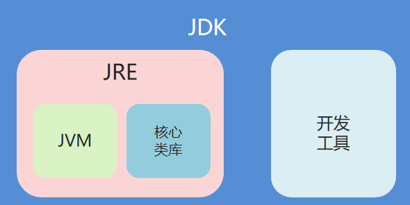

# Java

# 前言：
不积跬步无以至千里，不积小流无以成江海。基础不牢，地动山摇。所以在学习java技术时，一定要打好基础。

本笔记是对之前学习Java知识的一个全面完整的复盘总结。一方面对于遗忘的知识点进一步回顾，另一方面对之前不牢固的基础进一步夯实。但是时间不等人，学习也要分清主次，对于重点知识要多花精力和时间去学习透彻，从源码入手，做到能够口述原理。对于次要的不要过多的浪费时间，一带而过。

同时，学习不能仅仅停留于理论层次，一定要结合实际，落到实处，以学以致用的心态去学习知识。

## 关于自学：
1、拓展==知识宽度==
2、==研究知识深度（java基础）==：【线程、集合（源码分析）、IO（底层设计模型）、网络模型】

## 计算机与编程语言
### 算法
我们要让计算机做计算，就需要找出计算的步骤，然后用编程语言写出来，计算机做的所有的事情都叫做计算。计算的步骤就是**算法**。

所有的程序都可以看做是做点输入，做点计算，做点输出。

## Java语言背景介绍：
Java语言是 **美国Sun公司**（Stanford University Network）在1995年推出的计算机语言。
Java之父：**詹姆斯·高斯林**（James Gosling）
2009年，Sun公司被**甲骨文公司**收购，所以我们现在访问oracle官网即可：[https://www.oracle.com](https://www.oracle.com/)

## java语言的三个版本：
- **JavaSE:** Java 语言的（标准版），用于桌面应用的开发，是其他两个版本的基础
- **JavaME:** Java 语言的（小型版），用于嵌入式消费类电子设备
- **JavaEE:** Java 语言的（企业版），用于 Web 方向的网站开发

# 1、 基础语法

## 1.1  java的跨平台原理 

#comprehend **什么是Java的跨平台原理？**

java是与平台无关的语言，平台无关有两种：**源代码级和目标代码级**。其中C/C++具有一定程度的源代码级平台无关，即用C/C++编写的应用程序不用修改只需重新编译就可以在不同平台上运行。而Java是依靠Java虚拟机JVM在目标代码级实现平台无关性的。

通过编译器，Java程序会被转换成与平台无关的字节码文件，通过Java的解释器便可以解释和运行Java的字节码。字节码是JVM的指定组，文件尺寸小，便于网络运输。其最大的好处是可跨平台运行，即Java的字节码可以编译一次，到处运行。用户使用任何一种Java编译器将Java源程序（.java）编译成字节码文件（.class）后，无论使用哪种操作系统，都可以在含有JVM的平台上运行。（JVM其实就是一个字节码解释器。）

## 1.2  JRE和JDK

#comprehend  **JDK、JRE、JVM之间的关系？**

**JVM（Java Virtual Machine）：** java虚拟机、能够实现跨平台。
**JRE（Java Runtime Environment）：** java运行环境、包含JVM和核心类库。
**JDK（Java Development Kit）：** java开发工具包、包含JRE和java开发工具（翻译 javac  运行 java）
**总结：** 开发和执行java程序、只需要安装jdk
- 关系图：


#think   **1、为什么配置环境变量？**

开发Java程序，需要使用JDK提供的开发工具（比如javac.exe、java.exe等命令），而这些工具在JDK的安装目录的bin目录下，如果不配置环境变量，那么这些命令只可以在该目录下执行。我们不可能把所有的java文件都放到JDK的bin目录下，所以配置环境变量的作用就是可以使bin目录下的java相关命令可以在任意目录下使用。

#think  **2、重启后为什么环境变量失效？**

环境变量配置好系统变量后，重启电脑后，发现输入javac命令和java命令出现错误。

临时改变：将系统变量中JAVA_HOME的变量值按Ctrl+S，然后按Ctrl+V，确定。但是此种方法重启电脑后会再次失效。

**永久改变：** 配置Path环境变量时选择用户变量，如果系统变量可以使用，建议使用系统变量不要更改，如果重启后会发生改变，则选择此种方法。

**新建：** 变量名：JAVA_HOME

变量值：将JDK的安装路径复制过来，注意：不带bin目录；

选择Path-->编辑-->编辑文本 -->.;%JAVA_HOME%\bin;用两个%包裹JAVA_HOME，然后拼上\bin 最后分号结束,放在变量值的最前面。


配置好后，需要删除系统变量中的JAVA_HOME和Path路径中的%JAVA_HOME%\bin，注意删除时需要小心，不要多删了。

校验是否配置成功：重新打开DOS窗口，输入javac命令查看结果

## 1.3  java程序结构

一般的java源程序文件（.java）由以下三部分组成：
1. package语句（0个或1个） 
2. import语句（0个或多个）
3. 类定义（1个或多个）

package语句表示该程序所属的包，只能有一个或者没有。如果有，必须放在最前面；如果没有，表示本程序属于默认包。

import语句表示引入其他类库中的类。可以有0个或者多个，必须放在类定义的前面。

类定义是java源程序的主要部分，每个文件可以定义若干类。

其它规范：
- 每一条Java语句都以分号“;”结束。
- 除了package和import语句之外其他执行具体操作的语句，都只能存在于类的{}中。
- Java严格区分大小写，使用时不能混淆。
- 一个程序可以有多个类，**但是==只能==且==必须有==一个主类**。**主类是指包含main()方法的类，是Java程序执行的入口点。**==**Tomcat的底层中包含main()方法。**==

​		main()方法是Java程序中一个特殊的方法，必须声明成public，使得在类的其他地方能够调用到它，且main()方法没有返回值，所以在它之前要加上void关键字。

## 1.4 数据类型

**1、为什么要区分数据类型？**

程序在执行过程中，需要对数据进行运算或者存储。这些数据存储在内存中的一块空间，为了方便使用，用变量名来代表该数据存储空间的位置。将数据指定给变量，就是将数据存储到对应的内存空间中；调用变量，就是将内存空间中的数据取出来使用。

一个变量代表一个内存空间，然而由于数据在存储时所需要的内存容量不同，不同的数据就必须分配不同大小的内存空间来存储，因此需要对不同的数据用不同的数据类型来区分。

按照性质进行分类，数据类型定义了数据的性质，取值范围，存储方式以及对数据所能进行的运算和操作。定义了数据的类型也就相应决定了数据的性质以及对应数据的操作，同时数据也就受到类型的保护，确保对数据不进行非法操作。

**2、数据类型的分类**

Java中数据类型分为两大类：==基本数据类型（primitive types）==和==引用数据类型（reference types）==。


基本数据类型是程序设计语言系统所定义、不可再分的数据类型。每种基本数据类型所占内存的大小是固定的，与软硬件环境无关。

基本数据类型在内存中存放的数据值本身。引用数据类型在内存中存放的是指向该数据的**地址**，不是数据本身，它往往由多个基本数据类型组成，因此，对引用数据类型的应用成为对象引用，引用数据类型也被称之为符合数据类型，在有的语言中称为指针。

**基本数据类型：**4类8种

- 整数型：byte，short，int，long

- 浮点型：float，double

- 布尔型：boolean

- 字符型：char

  |   数据类型   |    关键字    | 占用字节 |  默认值  |    取值范围    |
  | :----------: | :----------: | :------: | :------: | :------------: |
  |    字节型    |     byte     |    1     |    0     |    -128~127    |
  |    短整型    |    short     |    2     |    0     |  -32768~32767  |
  |     整型     |  int(默认)   |    4     |    0     | -2^15~(2^15)-1 |
  |    长整型    |     long     |    8     |    0L    | -2^31~(2^31)-1 |
  | 单精度浮点型 |    float     |    4     |   0.0F   |       略       |
  | 双精度浮点型 | double(默认) |    8     |   0.0D   |       略       |
  |    布尔型    |   boolean    |    1     |  false   |  true、false   |
  |    字符型    |     char     |    2     | '\u0000' |    0~65535     |

  > 字符型采用Unicode字符集编码方案，\u表示一个Unicode值，后面的4个十六进制值表示那个Unicode字符。
  > java语言提供了数值类型量的最大值、最小值的代码。最大值的代码是MAX_VALUE,最小值是MIN_VALUE。如果要使用，只需要在代码前面加上所属的类全名。
  > 注意：浮点数不能用于精确的计算，当我们在做精确的计算时，要用整数，而且整数的运算速度也比浮点数快。

  **引用数据类型：**

- 类

- 数组

- 接口

## 1.5 关键字和标识符

**1、关键字：** Java中被赋予特定含义的一些单词。

- 关键字字母**全部小写**
- 在常用代码编辑器中，有特殊颜色标记。


> 注意：main不是关键字

**2、标识符：**  由数字、字母(英文字母、汉字（不推荐）)、__ 和$组成。
- 不能是数字开头
- 不能是java中的关键字
- 严格区分大小写

**命名约定**

1. 小驼峰命名法：给**变量和方法**起名字的规则
	规则：第一个单词的首字母小写、其他单词的首字母大写。
	示例：int maxAge = 100;  getMaxAge();
	
2. 大驼峰命名法：给**类**起名字的规则
	规则：每个单词的首字母大写
	示例：MyTest
	
3. 见名知意

## 1.6 常量和变量
### 1.6.1 常量
常量存储的是在程序中不能被修改的固定值，即常量是在程序运行的整个过程中保持其值不变。

**1、常量类型**
1. 整型常量
2. 浮点型常量
	根据内存长度的不同，可以分为单精度浮点常量(f)和双精度浮点常量。
3. 布尔型常量
4. 字符型常量 
	用一对单引号括起来的单个字符，如'a','9'。
	**转义符**：有特殊含义、很难用一般方式来表达的字符，如回车、换行等。所有的转义符都用反斜线\开头，后面跟一个字符来表示某个特定的转义符。
5. 字符串常量
	用双引号括起来的一串若干个字符(可以为空)。*字符串中可以包括转义符，但标志字符串开始和结束的双引号必须在源代码的同一行上。例如："您好，世界\n"*
6. 空常量
	null，一个特殊的值。

	

**2、常量的声明**
常量的声明和变量的声明形式基本一样，只需要关键字`final`标识，通常`final`写在最前面。**常量名全部大写。**
	示例：
```java
final int MAX = 10;
final float PI = 3.14F;
```

**3、常量的好处**
1. 增加可读性，从常量名可知常量的含义；
2. 增强可维护性，若程序多处使用常量时，当要对它们进行修改时，只需要在声明语句中修改一处即可。


### 1.6.2 变量
**变量声明**
变量在使用前必须先声明。
变量具有四个基本要素：名字、类型、值和作用域。
格式：数据类型 变量名 = 数据值;

**注意事项：**
- 同一个作用域变量名不允许重复定义；
- 一条语句可以定义多个变量，但需要使用逗号分割；
- Java程序中可以随时定义变量，不必集中在执行语句之前；
- ==变量的作用域：只在它所在的大括号中有效。==

## 1.7 数据类型转换

在Java中，一些数据类型之间是可以相互转换的。分为两种情况：自动类型转换和强制类型转换。

### 1.1 隐式转换(理解)

把一个表示数据范围小的数值或者变量赋值给另一个表示数据范围大的变量。这种转换方式是自动的，直接书写即可。
类型从小到大关系图：

说明：

1.  整数默认是int类型，byte、short和char类型数据参与运算均会自动转换为int类型。
```java
byte b1 = 10;
byte b2 = 20;
byte b3 = b1 + b2; 
// 第三行代码会报错，b1和b2会自动转换为int类型，计算结果为int，int赋值给byte需要强制类型转换。
// 修改为:
int num = b1 + b2;
// 或者：
byte b3 = (byte) (b1 + b2);
```

2.  boolean类型不能与其他基本数据类型相互转换。

### 1.2 强制转换(理解)

把一个表示数据范围大的数值或者变量赋值给另一个表示数据范围小的变量。

强制类型转换格式：目标数据类型 变量名 = (目标数据类型)值或者变量;

例如：

```java
byte a = 3;
byte b = 4;
byte c = a + b; //错误。因为两个byte变量相加，会先提升为int类型
byte d = 3 + 4; //正确。常量优化机制
```

>强制类型转换只是根据变量计算出了一个新的类型的值，并不会改变那个变量，无论是值还是类型都不会改变。
常量优化机制：
在编译时，整数常量的计算会直接算出结果，并且会自动判断该结果是否在byte取值范围内，
在：编译通过
不在：编译失败

## 1.8 运算符
### 1.8.1 算术运算符
`+`  `-`  `*`  `/` `%`

注意：
	/：整数和整数相除还是整数，余数省去；有浮点数参与运算，得到的商是浮点数。
	%：获取余数。判断变量是否被整除、奇偶数、轮询等。
	
**自增自减运算符**
	`++`：加一
	`--`：减一

注意：
>++或--在前：先对该变量做自增或自减，然后再拿变量参与操作；
>++或--在后：先将该变量原本的值参与操作，然后再进行自增或自减。

### 1.8.2 赋值运算符

| 符号 | 作用       | 说明                  |
| ---- | ---------- | --------------------- |
| =    | 赋值       | a=10，将10赋值给变量a |
| +=   | 加后赋值   | a+=b，将a+b的值给a    |
| -=   | 减后赋值   | a-=b，将a-b的值给a    |
| *=   | 乘后赋值   | a*=b，将a×b的值给a    |
| /=   | 除后赋值   | a/=b，将a÷b的商给a    |
| %=   | 取余后赋值 | a%=b，将a÷b的余数给a  |

==注意：扩展运算符是一个整体，中间不能出现空格，且底层自带强转功能。==

### 1.8.3 关系运算符

注意：`==` 不能用于浮点数之间的比较，因为浮点数在表达式上有难以避免的微小误差，精确的相等比较无法达到，所以这类比较没有意义。

| 符号 | 说明                                                    |
| ---- | ------------------------------------------------------- |
| `==`   | 判断a和b的值是否相等，成立为true，不成立为false   |
| !=   | a!=b，判断a和b的值是否不相等，成立为true，不成立为false |
| >    | a>b，判断a是否大于b，成立为true，不成立为false          |
| >=   | a>=b，判断a是否大于等于b，成立为true，不成立为false     |
| <    | a<b，判断a是否小于b，成立为true，不成立为false          |
| <=   | a<=b，判断a是否小于等于b，成立为true，不成立为false     |

### 1.8.4 逻辑运算符

逻辑运算符把各个运算的关系表达式连接起来组成一个复杂的逻辑表达式，以判断程序中的表达式是否成立，判断的结果是 true 或 false。

| 符号 | 作用     | 说明                                         |
| ---- | -------- | -------------------------------------------- |
| &    | 逻辑与   | a&b，a和b都是true，结果为true，否则为false   |
| \|   | 逻辑或   | a\|b，a和b都是false，结果为false，否则为true |
| ^    | 逻辑异或 | a^b，a和b结果不同为true，相同为false         |
| !    | 逻辑非   | !a，结果和a的结果正好相反                    |

####  短路逻辑运算符（理解）

| 符号 | 作用   | 说明                         |
| ---- | ------ | ---------------------------- |
| &&   | 短路与 | 作用和&相同，但是有短路效果  |
| \|\| | 短路或 | 作用和\|相同，但是有短路效果 |

#comprehend **& 和 && 的区别 :**

& : 无论符号左边是true还是false, 右边都要继续执行
&& : 具有短路效果, 符号左边为false的时候（已经决定整体结果位false）, 右边就不执行了;如果符号左边为true, 右边要继续执行.

#comprehend  **| 和 || 的区别 :**

`|` : 无论符号左边是true还是false, 右边都要继续执行
`||` : 具有短路效果, 符号左边为true的时候（已经决定整体结果位true）, 右边就不执行了;如果符号左边为false, 右边要继续执行.

### 1.8.5 三元运算符
格式: `关系表达式 ? 表达式1 : 表达式2;`
			
数据类型 变量 = 布尔表达式 ? 表达式1 : 表达式2;
			
数据类型由表达式1 、 表达式2的结果类型决定

执行流程：
		首先计算关系表达式的值
		如果值为true，取表达式1的值
		如果值为false，取表达式2的值	

### 1.8.6 位运算符


### 1.8.7 运算符和表达式的优先级
**运算符的优先级（从高到低）**


| 优先级 | 描述         | 运算符                  |
| ------ | ------------ | ----------------------- |
| 1      | 括号         | .  ()   []              |
| 2      | 正负号       | +、-                    |
| 3      | 自增自减，非 | ++、--、!               |
| 4      | 乘除，取余   | `*`、/、%                 |
| 5      | 加减         | +、-                    |
| 6      | 移位运算     | <<、>>、>>>             |
| 7      | 大小关系     | >、>=、<、<=            |
| 8      | 相等关系     | `==`、!=                  |
| 9      | 按位与       | &                       |
| 10     | 按位异或     | ^                       |
| 11     | 按位或       | \|                      |
| 12     | 逻辑与       | &&                      |
| 13     | 逻辑或       | \|\|                    |
| 14     | 条件运算     | ?:                      |
| 15     | 赋值运算     | =、+=、-=、`*=`、/=、%=   |
| 16     | 位赋值运算   | &=、\|=、<<=、>>=、>>>= |

如果在程序中，要改变运算顺序，可以使用()。


# 2、 流程控制

流程是程序运行时，各语句的执行顺序。流程控制语句是用来控制程序中各语句执行顺序的语句，是程序中基础又关键的部分。
最主要的流程控制方式是结构化程序设计中规定的三种基本流程结构：顺序结构、分支结构和循环结构。

## 2.1 语句与复合语句
Java中的语句是指计算机完成某种特定运算及操作的命令，一条语句执行完后再执行另一条语句。
语句可以是以分号;结尾的简单语句，也可以是用一对花括号{}括起来的复合语句。复合语句定义变量的作用域。一个复合语句可以嵌套另一个复合语句，但是java中不允许在两个嵌套的复合语句内声明同名的变量。

**注释语句**

单行注释：`//`
多行注释：`/**/`
文档注释：`/** */`主要用来描述**类、数据和方法**，它是JDK提供的javadoc.exe命令所生成的扩展名为.html的文件，从而为程序提供文档说明。

## 2.2 顺序语句
顺序结构是程序中最简单最基本的流程控制，没有特定的语法结构，按照代码的先后顺序，依次执行，程序中大多数的代码都是这样执行的。


## 2.3 分支语句

### 2.3.1 if语句
1、格式一
```java
// 筛选一种情况
if(关系表达式){
    
    语句体;
}

其它语句;


```

2、格式二
```java
if (关系表达式) {
    
    语句体1;	
    
} else {
    
    语句体2;	
}

其它语句;

```

3、格式三
```java
if (关系表达式1) {
    
    语句体1;	
    
} else if(关系表达式2){
    
    语句体2;	
} else if(关系表达式3){
    
    语句体3;	
}...else {
    
    语句体n;	
}

其它语句;

```

>if分支的语句序列如果只有一个语句，可以不需要用大括号括起来；否则，分支中的所有语句都需要用大括号括起，以便与分支之外的语句相区分。

**常见错误：**
`=`是赋值，`==`才是等于，if的()中的值要求true或者false

### 2.3.2 switch语句
在多重条件选择的情况下，可以使用if-else结构来实现其功能，但是使用多分支开关语句会使程序更为精炼、清晰。switch就是多分支开关语句，常用于多重选择。
```java
switch(表达式){
        case 值1： 
            语句体1；
            break;
        case 值2： 
            语句体2；
            break;
        case 值3： 
            语句体3；
            break;
        ...
        default:
        	语句体n+1；
            break;
}

/*
格式说明：
表达式：（将要匹配的值） 取值为byte、short、int、char，JDK5以后可以是枚举，JDK7以后可以是String。
case：后面跟的是要和表达式进行比较的值 （被匹配的值）。
break：表示中断，结束的意思，用来结束switch语句。
default：表示所有情况都不匹配的时候，就执行该处的内容，和if语句的else相似。
*/
```
执行流程：

-  首先计算出表达式的值
   
-  其次，和case依次比较，一旦有对应的值，就会执行相应的语句，在执行的过程中，遇到break就会结 束。
   
-  最后，如果所有的case都和表达式的值不匹配，就会执行default语句体部分，然后程序结束掉。

>1、case给出的值不允许重复；
>2、case后面的值只能是常量，不能是变量。

**case穿透**
switch语句的每一个case判断，在一般情况下都会有break语句，以指明这个分支执行完后，就跳出该switch语句，或者遇到结尾的}结束switch语句。
但在某些情况下，可能不需要break语句，例如要若干判断值共享一个分支时，就可以实现由不同的判断语句流入相同的分支。这就是case穿透。


## 2.4 循环语句
循环结构就是在一定情况下，反复执行某段程序的控制结构，被反复执行的语句序列称为循环体。在Java语言中循环结构是由循环语句来实现的。Java语言中的循环语句共有三种：for循环、while循环和do-while循环。

### 2.4.1 for循环
```java
for(初始化语句; 条件判断语句; 条件控制语句){
    
    循环体语句;
}

//示例：
for(int i = 1;i <= 5;i++){
    
    System.out.println("HelloWorld");
}
```

执行流程：


### 2.4.2 while循环
```java
初始化语句;
while(条件判断){
    循环体语句;
    
    条件控制语句;
}
```


### 2.4.3 do-while循环
```java
初始化语句；
	do{
	循环体语句；
	条件控制语句；
	}while(条件判断语句)；
```

### 2.4.4 三种循环的区别
#comprehend **for和while的区别：**

条件控制语句所控制的自增变量：
for循环：因为归属for循环的语法结构中，在for循环结束后，就不能再次被访问到了；

while循环：对于while循环来说不归属其语法结构中，在while循环结束后，该变量还可以继续使用。

#comprehend **for、while和do...while区别：**

for循环和while循环先判断条件是否成立，然后决定是否执行循环体（先判断后执行）

do...while循环先执行一次循环体，然后判断条件是否成立，是否继续执行循环体（先执行后判断）

### 2.4.5 死循环
```java
for死循环格式 :
for(;;){

}

while死循环格式 :

while(true){

}

do..while死循环格式 :

do{

}while(true);
```

### 2.4.6 循环嵌套
如果循环语句的循环体内又有循环语句，则称多重循环，也称循环嵌套。常用的有二重循环和三重循环。
九九乘法表：
```java
public void theMultiplicationTable() {  
    //外循环控制行数  
 for (int i = 1; i < 10; i++) {  
        //内循环控制列数  
 for (int j = 1; j <= i; j++) {  
            System.out.print(i+"*"+j+"="+i*j+"\t");  
 }  
        //换行  
 System.out.println();  
 }
```

### 2.4.7 跳转控制语句
循环中的跳转语句可以实现循环执行过程中的流程转移。在switch语句中，我们用过的break语句就是一种跳转语句。为了提高程序的可靠性和可读性，Java语言不支持无条件跳转的goto语句，但是java语言提供了三种无条件转移语句：break，continue和return。
**1、break语句**
	- 跳出循环，结束循环
	- break语句只能在循环和switch语句中进行使用

**2、continue语句**
	- 终止当前这一轮的循环，跳过本轮循环剩余的语句，直接进入下一轮循环
	- continue只能在循环语句中进行使用
**3、return语句**
	- 使程序从方法中返回，并为方法返回一个值。如果return语句未出现在方法中，则执行完方法的最后一条语句后会自动返回到主程序。
### 2.4.8 知识点：Random随机数
```java
Random r = new Random();
//[m,n]之间的随机整数
r.nextInt(n-m+1)+m;
```


# 3、 数组
## 3.1 什么是数组？

所谓数组就是若干个**相同数据类型**的元素按一定**顺序**排列的**数据长度固定的集合或容器**。数组元素可以是基本数据类型，也可以由对象组成。
从构成形式上分，可以分为一维数组和多维数组。

数组的特点：
- 数组中元素的数据类型相同；
- 数组中元素有序存放；
- 数组有索引，索引从0开始。

## 3.2 栈内存和堆内存

为了充分地理解数组的概念，首先需要了解Java语言有关内存分配的知识。Java语言把内存分为两种：**栈内存和堆内存**

| 区域名称   | 作用                                                         |
| ---------- | ------------------------------------------------------------ |
| 寄存器     | 给CPU使用，和我们开发无关。                                  |
| 本地方法栈 | JVM在使用操作系统功能的时候使用，和我们开发无关。            |
| ==方法区== | ==存储可以运行的class文件。==                                |
| ==堆内存== | ==存储对象或者数组，new来创建的，都存储在堆内存。==          |
| ==方法栈== | ==方法运行时使用的内存，比如main方法运行，进入方法栈中执行。== |

在**方法**中定义的一些**基本类型的变量和对象的引用变量**都在方法的栈内存中分配，当在一段代码块中定义一个变量时，Java就在栈内存中为这个变量分配内存空间；当超出变量的作用域后，Java会自动释放掉为该变量所分配的内存空间。
堆内存用来存放由**new运算符创建的数组或对象**，在堆中分配的内存，由Java虚拟机的**垃圾回收器**来自动管理。

**引用变量**：在堆中创建了一个数组或对象后，同时还在栈中定义一个特殊的变量，让栈中的这个变量的取值等于数组或对象在**堆内存中的首地址**。栈中的这个变量就成了数组或对象的**引用变量**。
引用变量实际上保存的是数组或对象在堆内存中的**首地址（也称为对象的句柄）**，以后就可以在程序中使用栈的引用变量来访问堆中的数组或对象。引用变量相当于是为数组或对象起的一个名称。

#think **为什么Java占用内存大？**

引用变量是普通的变量，定义时在栈中分配内存，在程序运行到其作用域之外被释放。而数组或对象本身在堆内存中分配内存，即使程序运行到使用new运算符创建数组或对象的语句所在的代码块之外，数组或对象本身占据的内存也不会被释放，当数组或对象在没有引用变量指向它时，就会变成垃圾，不能再被使用，但仍然占据内存空间不放，在随后一个不确定的时间被垃圾回收器释放掉，这就是Java比较占内存的原因。

## 3.3 一维数组
一维数组是最简单的数组，其逻辑结构是线性表。要使用一维数组，需要经过定义、初始化和应用等过程。

### 3.3.1 一维数组的定义
1、声明数组：
```java
数据类型 [ ] 数组名   //常用
数据类型 数组名 [ ]  //C/C++的定义格式
```
 2、分配内存给数组
 ```java
数组名 = new 数据类型[个数]
 ```

### 3.3.2 数组的初始化
1、动态初始化
数组动态初始化就是只给定数组的长度，由系统给出默认初始化值。
```java
数据类型 [ ] 数组名 = new 数据类型[数组长度]

//示例
int [ ] arr = new int[3];
```

2、静态初始化
数组的静态初始化就是在创建数组时，直接将元素确定。
```java
//完整版格式
数据类型 [ ] 数组名 = new 数据类型[ ]{元素1,元素2...};

//简化版格式
数据类型 [ ] 数组名 = {元素1,元素2...};
```

```md

注意:
         打印数组变量的时候, 会打印出数组的内存地址

        [I@10f87f48 :

                        @ : 分隔符
                        [ : 当前的空间是一个数组类型
                        I : 当前数组容器中所存储的数据类型
                        10f87f48 : 十六进制内存地址
```

3、数组元素访问
```java
数组名[索引];
```

## 3.4 数组的内存分配图
1、一个数组内存图

2、两个数组内存图

 3、多个数组指向相同内存图
 

 >声明数组并分配相应的内存空间，引用变量指向数组对象。引用变量就相当于C语言中的指针变量，而数组对象就是指针变量指向的那个内存块。所以在Java内部还是有指针，只是把指针的概念对用户隐藏起来了，而用户使用的是引用变量。

*数组用new运算符分配内存空间的同时，数组的每个元素都会自动赋一个默认的值：整数为0，浮点数为0.0，字符为\0，布尔类型为false，引用类型为null。==这是因为数组实际是一个引用型的变量，而其每个元素是引用型变量的成员变量==*
                       
数组类Arrays的常用方法
- sort(arr) 对数组arr升序排序后仍存放在arr中；
- copyOf(arr,int) 截取数组中长度为int的数组元素复制给调用数组，==集合扩容==；
- equals(arr1，arr2) 判断同类型的两个数组中对应元素值是否相等。

## 3.5 ==数组操作的两个常见问题==

### ==3.5.1 索引越界异常==

- 出现原因

  ```java
  public class ArrayDemo {
      public static void main(String[] args) {
          int[] arr = new int[3];			//数组长度为3，索引为0,1,2
          System.out.println(arr[3]);  //最大索引为2
      }
  }
  
  ```

  数组长度为3，索引范围是0~2，但是我们却访问了一个3的索引。

  程序运行后，将会抛出`ArrayIndexOutOfBoundsException` 数组越界异常。在开发中，数组的越界异常是不能出现的，一旦出现了，就必须要修改我们编写的代码。 

- ==解决方案==

  ==将错误的索引修改为正确的索引范围即可！==

### ==3.5.2  空指针异常==

- 出现原因

  ```java
  public class ArrayDemo {
      public static void main(String[] args) {
          int[] arr = new int[3];
  
          //把null赋值给数组
          arr = null;
          System.out.println(arr[0]);
      }
  }
  ```

  arr = null 这行代码，意味着变量arr将不会在保存数组的内存地址，也就不允许再操作数组了，因此运行的时候会抛出 `NullPointerException` 空指针异常。在开发中，数组的空指针异常是不能出现的，一旦出现了，就必须要修改我们编写的代码。

- ==解决方案==

  ==给数组一个真正的堆内存空间引用即可！==
  
## 3.6 数组遍历
数组遍历：就是将数组中的每个元素分别获取出来，就是遍历。遍历也是数组操作中的基石。
方式一：for循环：需要索引
```java
public class ArrayTest01 {
    public static void main(String[] args) {
        //定义数组
        int[] arr = {11, 22, 33, 44, 55};

        //使用通用的遍历格式,数组的索引是0到length-1，可以作为循环的条件
        for(int x=0; x<arr.length; x++) {
            System.out.println(arr[x]);
        }
    }
}

```

方式二：foreach循环：不需要索引
```java
for(type element : array)
{
	System.out.println(element);
}
```
其功能是每次从数组array中取出一个元素，自动赋值给element，用户不用判断是否超出了数组的长度。需要注意的是element的类型必须与数组array中元素的类型相同

## 3.7 数组的应用
### 3.7.1 数组获取最大值
```java

import java.util.Scanner;

public class TestArray {
    /*
        需求: 从数组中查找最大值

                int[] arr = {12,45,98,73,60};

        实现步骤:
                1. 假设数组中的第一个元素为最大值
                2. 遍历数组, 获取每一个元素, 准备进行比较
                3. 如果比较的过程中, 出现了比max更大的, 让max记录更大的值
                4. 循环结束后, 打印最大值.
     */
    public static void main(String[] args) {
        int[] arr = {12,45,98,73,60};
        // 1. 假设数组中的第一个元素为最大值
        int max = arr[0];
        // 2. 遍历数组, 获取每一个元素, 准备进行比较
        for(int i = 1; i < arr.length; i++){
            // 3. 如果比较的过程中, 出现了比max更大的, 让max记录更大的值
            if(arr[i] > max){
                max = arr[i];
            }
        }
        //  4. 循环结束后, 打印最大值.
        System.out.println("max:" + max);
    }
}

```

也可以使用**数据排序**，然后获取最大值。最小值同理。
### 3.7.2 数组获取最大值和次最大值
  思路：
  1. 定义一个数组，假设前两个元素arr[0]和arr[1]是最大值和最小值，比较arr[0]和arr[1]的大小；
  2. 如果arr[0]大于arr[1]，则假设最大值是arr[0]，次最大值是arr[1]；
  3. 反之，假设最大值是arr[1]，次最大值是arr[0]；
  4. 遍历数组，从第三个元素arr[2]开始进行比较；
  5. 如果遍历出来的元素比最大值大，则该元素为新的最大值，原最大值(因为比初始假设的次最大值大)降为次最大值，将其赋值给次最大值；
  6. 如果遍历出来的元素没有比最大值大，则与次最大值进行比较。
  7. 如果大于次最大值，则该元素为新的次最大值。

方式二：数组排序，然后获取最大值和次最大值。
最小值同理。

### 3.7.3 数组基本查找

需求： 已知一个数组 arr = {19, 28, 37, 46, 50}; 键盘录入一个数据，查找该数据在数组中的索引，并在控 制台输出找到的索引值。
    
思路： 1.定义一个数组，用静态初始化完成数组元素的初始化 2.键盘录入要查找的数据，用一个变量接收 3.定义一个索引变量，初始值为-1 4.遍历数组，获取到数组中的每一个元素 5.拿键盘录入的数据和数组中的每一个元素进行比较，如果值相同，就把该值对应的索引赋值给索引变量，并结束循环 6.输出索引变量
    
-   代码实现：
```java
public static void main(String[] args) {
        // 1.定义一个数组，用静态初始化完成数组元素的初始化
        int[] arr = {19, 28, 37, 46, 50};
        // 2.键盘录入要查找的数据，用一个变量接收
        Scanner sc = new Scanner(System.in);
        System.out.println("请输入您要查找的元素:");
        int num = sc.nextInt();
        // 3.定义一个索引变量，初始值为-1
        // 假设要查找的数据, 在数组中就是不存在的
        int index = -1;
        // 4.遍历数组，获取到数组中的每一个元素
        for (int i = 0; i < arr.length; i++) {
            // 5.拿键盘录入的数据和数组中的每一个元素进行比较，如果值相同，就把该值对应的索引赋值给索引变量，并结束循环
            if(num == arr[i]){
                // 如果值相同，就把该值对应的索引赋值给索引变量，并结束循环
                index = i;
                break;
            }
        }
        //  6.输出索引变量
        System.out.println(index);
    }
}

```

### 3.7.4 [约瑟夫环](../../Excalidraw/约瑟夫环.md)
需求：假设有N个人围坐一圈并按顺时针从1到N进行编号，从第S个人开始进行1到M报数，报数到第M的人，此人出圈。然后从他下一个人重新开始从1到M进行报数，如此进行下去，每次报数到M的人就出圈，直到所有人出圈为止。给出这N个人的出圈顺序。

思路：


## 3.8 多维数组
### 3.8.1 二维数组
声明格式
```java
数据类型 [ ] [  ] 数组名 = new 数据类型 [行数] [列数]
```

对于不规则矩形二维数组，在定义时只需要给出高层维数即可。
```java
int [ ] [ ] arr = new int [n] [ ];   //这里只要求了行数是多少，并没有指定列数，因此，每行的列数可以不一样
```

在二维数组中，若要取得二维数组的行数，只要在数组名后面加上.length属性即可；若要取得数组中每行元素的个数，则需要在数组名后加上该行的下标(索引)，再加上.length即可。

# 4、字符串
字符串就是一系列字符的序列，在Java中用一对双引号括起来，也是编程中经常用到的数据结构。在Java中无论是字符串常量还是字符串变量都是用类来实现的。
程序中用到的字符串可以分为两大类：
一类是创建之后不会再做修改和变动的字符串变量：String。常用于比较、搜索。
另一类是创建之后允许再做修改的字符串变量：StringBuilder。常用于添加、修改、插入等。

## 4.1 String
### 4.1.1 概述
1、String 类在 java.lang 包下，所以使用的时候不需要导包

2、String 类代表字符串，Java 程序中的所有字符串文字（例如“abc”）都被实现为此类的实例也就是说，Java 程序中所有的双引号字符串，都是 String 类的对象

**3、字符串不可变，它们的值在创建后不能被更改**

注意：String这个类比较特殊，打印其对象名的时候，不会出现内存地址，而是该对象记录的真实内容。

### 4.1.2 创建字符串对象的区别对比
1. 通过构造方法创建：通过new创建的字符串对象，每一次new都会申请一个内存空间，虽然内容相同，但是地址值不同。
2. **直接赋值方式创建：以""方式给出的字符串，只要字符串的序列相同(顺序和大小写)，无论在程序代码中出现几次，JVM 都只会建立一个String对象，并在字符串池中维护。**

### 4.1.3 字符串的比较
`==`比较的是基本数据类型：比较的是具体的值；
`==`比较的是引用数据类型：比较的是对象地址值。

**String类 : public boolean equals(String s) 比较两个字符串内容是否相同、区分大小写**
```java
package com.itheima.stringmethod;

public class Demo1Equals {
    public static void main(String[] args) {
        String s1 = "abc";
        String s2 = "ABC";
        String s3 = "abc";

        // equals : 比较字符串内容, 区分大小写
        System.out.println(s1.equals(s2));
        System.out.println(s1.equals(s3));

        // equalsIgnoreCase : 比较字符串内容, 忽略大小写
        System.out.println(s1.equalsIgnoreCase(s2));
    }
}

```

### 4.1.4 String常用方法
1. ==public boolean equals(Object anObject) 比较字符串的内容，严格区分大小写；==
2. public boolean equalsIgnoreCase(String anotherString) 比较字符串的内容，忽略大小写；
3. public int length() 返回此字符串的长度；
4. public char charAt(int index) 返回指定索引处的 char 值；
5. public char[] toCharArray() 将字符串拆分为字符数组后返回；
6. ==public String substring(int beginIndex, int endIndex) 根据开始和结束索引进行截取，得到新的字符串**包含头，不包含尾）**；==
7. public String substring(int beginIndex) 从传入的索引处截取，截取到末尾，得到新的字符串；
8. ==public String replace(CharSequence target, CharSequence replacement) 使用新值，将字符串中的旧值替换，得到新的字符串；==
9. ==public String[] split(String regex) 根据传入的规则切割字符串，得到字符串数组。==


## 4.2 StringBuilder

### 4.2.1 StringBuilder类概述

**概述 :** StringBuilder 是一个可变的字符串类，我们可以把它看成是一个容器，这里的可变指的是 StringBuilder 对象中的内容是可变的

### 4.2.2 StringBuilder类和String类的区别

- ==**String类：**内容是不可变的==
- ==**StringBuilder类：**内容是可变的==

### 4.2.3 StringBuilder类的构造方法

**常用的构造方法**

| 方法名                             | 说明                                       |
| ---------------------------------- | ------------------------------------------ |
| public StringBuilder()             | 创建一个空白可变字符串对象，不含有任何内容 |
| public StringBuilder(String   str) | 根据字符串的内容，来创建可变字符串对象     |

### 4.2.4 StringBuilder常用的成员方法

- **添加和反转方法**

  | 方法名                                  | 说明                     |
  | --------------------------------------- | ------------------------ |
  | public StringBuilder   append(任意类型) | 添加数据，并返回对象本身 |
  | public StringBuilder   reverse()        | 返回相反的字符序列       |

- **示例代码**

```java
public class StringBuilderDemo01 {
    public static void main(String[] args) {
        //创建对象
        StringBuilder sb = new StringBuilder();

        //public StringBuilder append(任意类型)：添加数据，并返回对象本身
//        StringBuilder sb2 = sb.append("hello");
//
//        System.out.println("sb:" + sb);
//        System.out.println("sb2:" + sb2);
//        System.out.println(sb == sb2);

//        sb.append("hello");
//        sb.append("world");
//        sb.append("java");
//        sb.append(100);

        //链式编程
        sb.append("hello").append("world").append("java").append(100);

        System.out.println("sb:" + sb);

        //public StringBuilder reverse()：返回相反的字符序列
        sb.reverse();
        System.out.println("sb:" + sb);
    }
}
```

### 4.2.5 StringBuilder和String相互转换【应用】

- **StringBuilder转换为String**

==public String toString()：通过 toString() 就可以实现把 StringBuilder 转换为 String==

- **String转换为StringBuilder**

public StringBuilder(String s)：通过构造方法就可以实现把 String 转换为 StringBuilder

- **示例代码**

```java
public class StringBuilderDemo02 {
    public static void main(String[] args) {
        /*
        //StringBuilder 转换为 String
        StringBuilder sb = new StringBuilder();
        sb.append("hello");

        //String s = sb; //这个是错误的做法

        //public String toString()：通过 toString() 就可以实现把 StringBuilder 转换为 String
        String s = sb.toString();
        System.out.println(s);
        */

        //String 转换为 StringBuilder
        String s = "hello";

        //StringBuilder sb = s; //这个是错误的做法

        //public StringBuilder(String s)：通过构造方法就可以实现把 String 转换为 StringBuilder
        StringBuilder sb = new StringBuilder(s);

        System.out.println(sb);
    }
}
```

### 4.2.6 StringBuilder拼接字符串案例

**案例需求 :** 

定义一个方法，把 int 数组中的数据按照指定的格式拼接成一个字符串返回，调用该方法，

并在控制台输出结果。例如，数组为int[] arr = {1,2,3}; ，执行方法后的输出结果为：[1, 2, 3]

**实现步骤 :** 

1. 定义一个 int 类型的数组，用静态初始化完成数组元素的初始化
2. 定义一个方法，用于把 int 数组中的数据按照指定格式拼接成一个字符串返回。
       返回值类型 String，参数列表 int[] arr
3. 在方法中用 StringBuilder 按照要求进行拼接，并把结果转成 String 返回
4. 调用方法，用一个变量接收结果
5. 输出结果

**代码实现 :** 

```java
/*
    思路：
        1:定义一个 int 类型的数组，用静态初始化完成数组元素的初始化
        2:定义一个方法，用于把 int 数组中的数据按照指定格式拼接成一个字符串返回。
          返回值类型 String，参数列表 int[] arr
        3:在方法中用 StringBuilder 按照要求进行拼接，并把结果转成 String 返回
        4:调用方法，用一个变量接收结果
        5:输出结果
 */
public class StringBuilderTest01 {
    public static void main(String[] args) {
        //定义一个 int 类型的数组，用静态初始化完成数组元素的初始化
        int[] arr = {1, 2, 3};

        //调用方法，用一个变量接收结果
        String s = arrayToString(arr);

        //输出结果
        System.out.println("s:" + s);

    }

    //定义一个方法，用于把 int 数组中的数据按照指定格式拼接成一个字符串返回
    /*
        两个明确：
            返回值类型：String
            参数：int[] arr
     */
    public static String arrayToString(int[] arr) {
        //在方法中用 StringBuilder 按照要求进行拼接，并把结果转成 String 返回
        StringBuilder sb = new StringBuilder();

        sb.append("[");

        for(int i=0; i<arr.length; i++) {
            if(i == arr.length-1) {
                sb.append(arr[i]);
            } else {
                sb.append(arr[i]).append(", ");
            }
        }

        sb.append("]");

        String s = sb.toString();

        return  s;
    }
}
```


# 5、类与对象
#### 类、方法、成员变量、对象等

# 6、面对对象


