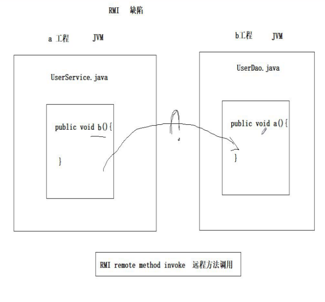

# Dubbo

# 1.RPC基础
## 1. 什么是RPC？
**RPC（Remote Procedure Call）** 即远程过程调用，通过名字我们就能看出 RPC 关注的是**远程调用**而非本地调用。有非常多的协议和技术都实现了RPC的过程。比如：HTTP REST风格，Java RMI规范、WebService SOAP协议、Hession等。

## 2.为什么要用RPC？
因为，**两个不同的服务器上的服务提供的方法不在一个内存空间**，所以，需要通过**网络编程**才能传递方法调用所需要的参数。并且，方法调用的结果也需要通过网络编程来接收。但是，如果我们自己手动网络编程来实现这个调用过程的话工作量是非常大的，因为，我们需要考虑底层传输方式（TCP还是UDP）、序列化方式等等方面。

## 3.RPC解决了什么问题？
通过 RPC 可以帮助我们调用远程计算机上某个服务的方法，这个过程就像调用本地方法一样简单。并且！我们不需要了解底层网络编程的具体细节。

例：两个不同的服务 A、B 部署在两台不同的机器上，服务 A 如果想要调用服务 B 中的某个方法的话就可以通过 RPC 来做。

总结：**RPC 的出现就是为了让调用远程方法像调用本地方法一样简单。**

## 4.RPC的原理是什么？
我们可以将RPC的核心功能看作是下面6个部分实现的：

1.  **客户端（服务消费端）** ：调用远程方法的一端。
2. **客户端 Stub** ： 这其实就是一代理类。代理类主要做的事情很简单，就是把你调用方法、类、方法参数等信息传递到服务端。
3. **网络传输** ： 网络传输就是你要把你调用的方法的信息比如说参数啊这些东西传输到服务端，然后服务端执行完之后再把返回结果通过网络传输给你传输回来。网络传输的实现方式有很多种比如最近基本的 Socket或者性能以及封装更加优秀的 Netty（推荐）。
4. **服务端 Stub** ：这个就不是代理类了。这里的服务端 Stub 实际指的就是接收到客户端执行方法的请求后，去指定对应的方法然后返回结果给客户端的类。
5. **服务端（服务提供端）** ：提供远程方法的一端。


1）服务消费方（client）以本地调用方式调用远程服务；

2）client stub接收到调用后负责将方法、参数等组装成能够进行网络传输的消息体(序列化)`RpcRequest`；

3）client stub找到服务地址，并将消息发送到服务端；

4）server stub收到消息后进行解码,将消息反序列化为Java对象：`RpcRequest`；

5）server stub根据解码结果，即`RpcRequest`中的类、方法、方法参数等信息调用本地的服务；

6）本地服务执行并将结果返回给server stub；

7）server stub将返回结果并将其组装成能够进行网络传输的消息头`RpcResponse`（序列化）并发送至消费方；

8）client stub接收到消息，并进行解码，将消息反序列化为Java对象：`RpcResponse`；

9）服务消费方得到最终结果。

 RPC的目标就是要2~8这些步骤都封装起来，让用户对这些细节透明。

# 2.Dubbo基础
## 1. Dubbo的发展历程
**dubbo早期是阿里巴巴企业内部一款高性能RPC(Remote Procedure Call)框架。【java基础RMI(remote method invoke远程方法调用）】** 后来阿里团队内部架构进行升级，替换了dubbo，dubbo开源了，阿里巴巴不再维护。之后当当网在dubbo的基础上进行二次开发，让dubbo使用更加简单，dubboX。随着dubbo不断被很多中小型企业采用，阿里巴巴看到了商机【提供生态】，于是进行维护，后来贡献给Apache基金会，所以现在我们聊得是apache dubbo。

apache dubbo2.7.4版本事实上基于阿里巴巴版本基础上维护。后来apache进行重构(基于中介思想)，推出3.0版本，但是还没有商用。


## 2. Dubbo的核心功能
#think  **Dubbo的核心功能**
根据Dubbo官方文档的介绍，Dubbo介绍了六大核心功能。
1. **面向接口代理的高性能RPC调用** ：提供高性能的基于代理的远程调用能力，服务以接口为粒度，为开发者屏蔽远程调用底层细节。
2. **智能负载均衡** 内置多种负载均衡策略，智能感知下游节点健康状况，显著减少调用延迟，提高系统吞吐量。
3. **服务自动注册与发现**：支持多种注册中心服务，服务实例上下线实时感知。
4. **高度可扩展能力**：遵循微内核+插件的设计原则，所有核心能力如Protocol、Transport、Serialization被设计为扩展点，平等对待内置实现和第三方实现。
5. **运行期流量调度** ：内置条件、脚本等路由策略，通过配置不同的路由规则，轻松实现灰度发布，同机房优先等功能。
6. **可视化的服务治理与运维**：提供丰富服务治理、运维工具：随时查询服务元数据、服务健康状态及调用统计，实时下发路由策略、调整配置参数。


另外，Dubbo3 基于 Dubbo2 演进而来，在保持原有核心功能特性的同时， Dubbo3 在易用性、超大规模微服务实践、云原生基础设施适配、安全设计等几大方向上进行了全面升级。
https://dubbo.apache.org/zh/docs/introduction/

## 3. 为什么要用Dubbo及Dubbo解决了什么问题？ 

#think  **为什么要用Dubbo？**

随着互联网的发展，网站的规模越来越大，用户数量越来越多。单一应用架构 、垂直应用架构无法满足我们的需求，这个时候分布式服务架构就诞生了。

分布式服务架构下，系统被拆分成不同的服务比如短信服务、安全服务，每个服务独立提供系统的某个核心服务。

我们可以使用 Java RMI（Java Remote Method Invocation）、Hessian这种支持远程调用的框架来简单地暴露和引用远程服务。但是！当服务越来越多之后，服务调用关系越来越复杂。当应用访问压力越来越大后，负载均衡以及服务监控的需求也迫在眉睫。我们可以用 F5 这类硬件来做负载均衡，但这样增加了成本，并且存在单点故障的风险。

不过，Dubbo 的出现让上述问题得到了解决。

#think **Dubbo 帮助我们解决了什么问题呢？**

1.  **负载均衡** ： 同一个服务部署在不同的机器时该调用哪一台机器上的服务。
2.  **服务调用链路生成** ： 随着系统的发展，服务越来越多，服务间依赖关系变得错踪复杂，甚至分不清哪个应用要在哪个应用之前启动，架构师都不能完整的描述应用的架构关系。Dubbo 可以为我们解决服务之间互相是如何调用的。
3.  **服务访问压力以及时长统计、资源调度和治理** ：基于访问压力实时管理集群容量，提高集群利用率。
4.  ......

另外，Dubbo 除了能够应用在分布式系统中，也可以应用在现在比较火的微服务系统中。不过，由于 Spring Cloud 在微服务中应用更加广泛，所以，一般我们提 Dubbo 的话，大部分是分布式系统的情况。

# 3.分布式基础
## 1. 什么是分布式？
**分布式`distributed`或者说 SOA 分布式重要的就是面向服务，说简单点，分布式就是我们把整个系统拆分成不同的服务然后将这些服务放在不同的服务器上减轻单体服务的压力提高并发量和性能。** 
比如，电商系统可以简单地拆分成订单系统、商品系统、登录系统等等，拆分之后的每个服务可以部署在不同的机器上，如果某一个服务的访问量比较大的话也可以将这个服务同时部署在多台机器上集群处理。 
**集群 cluster**
    - 拆分后的东西做成多个


## 2.为什么要用分布式？
从开发角度来讲单体应用的代码都集中在一起，而分布式系统的代码根据业务被拆分。所以，每个团队可以负责一个服务的开发，这样提升了开发效率。另外，代码根据业务拆分之后更加便于维护和扩展。

另外，将系统拆分成分布式之后不光便于系统扩展和维护，更能提高整个系统的性能。比如说：将整个系统拆分成不同的服务或者系统，然后每个服务或者系统单独部署在一台服务器上，又或者单独对某个服务或者系统做集群，会很大程度上提高系统的性能。

# 4.Dubbo使用
## 1.如何使用Dubbo？
### 1.1 [架构演进](../../Excalidraw/架构演进.md)过程

互联网架构特点：三高：①高并发、②高可用、③高可靠(安全)

互联网架构设计目标：尽量达到三高要求！

- 秒杀业务：割韭菜，预约秒杀（大数据筛选优质用户）（可用，可靠）
- 开发白名单和黑名单：流量控制作用

- **架构演进过程：**
    
    - **单体架构**：
		- 优点：简单，开发部署方便，小项目首选；
		- 缺点：启动慢，可靠性差，可伸缩性差，扩展性和可维护性差，性能低。
  
    
  
    - **垂直架构**：
		- 垂直架构是将单体架构中的多个模块拆分为多个独立的项目，形成多个独立的单体架构。
		- **存在问题：重复功能太多。**
  
    
  
    - **分布式架构**：
		- 是指在垂直架构的基础上，将公共业务模块抽取出来，作为独立的服务，供其他调用者消费，以实现服务的共享和重用。
		- 存在问题：服务提供方一旦产生变更，所有消费方都需要变更。
  
    
  
    - **SOA架构**：核心ESB
  

 	   

    - **微服务架构**

 	   

### 4.2 Dubbo架构
#think **Dubbo的核心组件**


**节点角色说明**

| 节点        | 角色说明                               |
| ----------- | -------------------------------------- |
| `Provider`  | 暴露服务的服务提供方                   |
| `Consumer`  | 调用远程服务的服务消费方               |
| `Registry`  | 服务注册与发现的注册中心               |
| `Monitor`   | 统计服务的调用次数和调用时间的监控中心 |
| `Container` | 服务运行容器                           |

#think **Dubbo 服务器注册与发现的流程？**

1. 服务容器负责启动，加载，运行服务提供者。
2. 服务提供者在启动时，向注册中心注册自己提供的服务。
3. 服务消费者在启动时，向注册中心订阅自己所需的服务。
4. 注册中心返回服务提供者地址列表给消费者，如果有变更，注册中心将基于长连接推送变更数据给消费者。
5. 服务消费者，从提供者地址列表中，基于软负载均衡算法，选一台提供者进行调用，如果调用失败，再选另一台调用。
6. 服务消费者和提供者，在内存中累计调用次数和调用时间，定时每分钟发送一次统计数据到监控中心。

#### 4.2.1 Dubbo架构的特点
Dubbo 架构具有以下几个特点，分别是连通性、健壮性、伸缩性、以及向未来架构的升级性。

**连通性**
- 注册中心负责服务地址的注册与查找，相当于目录服务，服务提供者和消费者只在启动时与注册中心交互，注册中心不转发请求，压力较小
- 监控中心负责统计各服务调用次数，调用时间等，统计先在内存汇总后每分钟一次发送到监控中心服务器，并以报表展示
- 服务提供者向注册中心注册其提供的服务，并汇报调用时间到监控中心，此时间不包含网络开销
- 服务消费者向注册中心获取服务提供者地址列表，并根据负载算法直接调用提供者，同时汇报调用时间到监控中心，此时间包含网络开销
- 注册中心，服务提供者，服务消费者三者之间均为长连接，监控中心除外
- 注册中心通过长连接感知服务提供者的存在，服务提供者宕机，注册中心将立即推送事件通知消费者
- 注册中心和监控中心全部宕机，不影响已运行的提供者和消费者，消费者在本地缓存了提供者列表
- 注册中心和监控中心都是可选的，服务消费者可以直连服务提供者

**健壮性**
- 监控中心宕掉不影响使用，只是丢失部分采样数据
- 数据库宕掉后，注册中心仍能通过缓存提供服务列表查询，但不能注册新服务
- 注册中心对等集群，任意一台宕掉后，将自动切换到另一台
- 注册中心全部宕掉后，服务提供者和服务消费者仍能通过本地缓存通讯
- 服务提供者无状态，任意一台宕掉后，不影响使用
- 服务提供者全部宕掉后，服务消费者应用将无法使用，并无限次重连等待服务提供者恢复

**伸缩性**
- 注册中心为对等集群，可动态增加机器部署实例，所有客户端将自动发现新的注册中心
- 服务提供者无状态，可动态增加机器部署实例，注册中心将推送新的服务提供者信息给消费者

**升级性**
- 当服务集群规模进一步扩大，带动IT治理结构进一步升级，需要实现动态部署，进行流动计算，现有分布式服务架构不会带来阻力。下图是未来可能的一种架构：


**节点角色说明**

| 节点         | 角色说明                               |
| ------------ | -------------------------------------- |
| `Deployer`   | 自动部署服务的本地代理                 |
| `Repository` | 仓库用于存储服务应用发布包             |
| `Scheduler`  | 调度中心基于访问压力自动增减服务提供者 |
| `Admin`      | 统一管理控制台                         |
| `Registry`   | 服务注册与发现的注册中心               |
| `Monitor`    | 统计服务的调用次数和调用时间的监控中心 |


### 4.3 Dubbo的实现原理

dubbo是基于动态代理实现的。


#### 4.2.2使用dubbo(入门程序)

- 安装使用Zookeeper

采用windows版本：直接解压缩

进入bin目录cmd


最小化，不要关闭！

**①  初始环境构建：（拆）**

- 创建一个工程：dubbo-service

​     spring配置整合

- 创建一个工程：dubbo-web     （依赖）

​    springmvc配置整合


​	maven依赖传递！


**②  改造基于dubbo项目调用**

[dubbo-service] ----------------dubbo---------------------[dubbo-web]

dubbo-service:

- 代码层面：  @Service （spring包）-----> @Service（dubbo包）   【2.7.4 】【3.0以后dubbo这个注解：@DubboService】

- 配置：

  - 注册中心地址 

  - 包扫描

  - 其他辅助配置

    

dubbo-web:

- 代码层面： @Autowired  （spring）----> @Reference  (dubbo)   【2.7.4 】【3.0以后dubbo这个注解：@DubboReference】
  - 注册中心地址
  - 包扫描
  - 其他辅助配置
  
  【练习】 尝试使用spring+dubbo入门案例：


#### [作业]：使用springboot整合dubbo

①  起步依赖

②  配置

详见整合讲义

【经验】GitHub服务器是架设在国外的，网络很慢，有些工程下载不下来，我们可以把这些工程的地址复制到gitee上，有个从GitHub导入，gitee是有vpn的，他会快速的下载到仓库中，也能及时更新。


==思路很重要！！！==


提供方：


提供方将服务地址注册到注册中心，我们需要进行配置属性


消费者：


消费者从注册中心获取服务地址，进行配置

> 运行：先开启Zookeeper，然后运行提供方，再运行消费者。

## 5、dubbo-admin

dubbo管理界面，一般提供给运维使用，或者开发阶段，测试，检测。

dubbo-admin项目采用的是前后端分离开发的方式：

- 前端：基于vue开发的，需要使用到nodejs
- 后端：基于springboot开发的。

### 5.1准备工作

【经验】下载完一个项目，要想去看这个项目，先去看它的文档，一般叫==README.md或者README.txt==

#### 5.1.1 安装前端环境

​	①安装nodejs 构建前端环境(一路下一步：中文用户名无法操作)

​	②执行前端命令


在这个目录输入cmd，执行命令：npm install

下载完成以后成功提示：==没有出现error==提示

继续执行命令：npm run dev 


出现以上界面，启动成功

#### 5.1.2 打包后端代码

①进入dubbo-admin-server目录


②在该目录下输入cmd，执行以下命令


③运行jar


## 6、==dubbo高级【面试会问】==

### 6.1 序列化

**RPC调用的时候，参数传递是==对象==必须==实现序列化接口==（涉及到网络传输的时候需要序列化和反序列化。）**


### 6.2 地址缓存

dubbo消费者**从注册中心中拉取到服务以后**，==默认会在本地缓存服务的地址==，也就是zookeeper宕机也==不影响服务的调用==。


### 6.3 超时

dubbo服务消费者调用服务生产者，如果时间太长容易造成连接占用，连接会耗尽，导致服务不可用。所以在服务调用的时候，==一定要设置超时时间==。在服务提供方和服务消费方都可以设置。

- 提供方设置：被动超时 @Service 注解：timeout设置超时时间，单位毫秒。


- 消费方设置：主动超时，同上@Reference。

==【思考】如果双方都设置了超时时间，时间一长一短，以谁为准呢？==

答：以消费方即主动超时为准。（测试结果）

### 6.4 重试

如果超时未调到，可以设置重试次数。双方都可以设置。默认重试次数是2，加上之前初始调用的一次，一共是三次。


服务的提供方和消费方是相对的，

### 6.5 多版本

服务**提供方**可以提供多个版本的服务，**消费方可以按需调用。**


## 7、关于dubbo的配置问题

思路：

- 不管是生产者还是消费者：都需要连接zookeeper
- 注解扫描配置。
- ==不同：生产者需要指定服务发布的协议(dubbo）和端口。==

服务提供方

```yml
dubbo:
  scan:
    base-packages: com.itheima.dubbo.service.impl

  protocol:
    name: dubbo
    port: -1
  registry:
    address: zookeeper://127.0.0.1:2181
```

服务消费方：

```yml
dubbo:
  registry:
    address: zookeeper://127.0.0.1:2181
```

==**【面试题】面试中会问dubbo服务发布时候会采用什么协议？为什么？**==

答：默认采用dubbo协议。==因为默认协议就是最优协议。==dubbo是一个底层协议，基于TCP的，越底层的协议性能越好，**报文封包次数少，拆包的次数也少**。


网络协议：7层拓扑协议(理论)，

实际生产使用：4层参考模型（应用层(http)、传输层(tcp)、网络层(ip)、物理层(交换机、路由器等)）

## 8、dubbo运维

- 集群cluster
  - 负载均衡：load balance  负载均衡算法：随机、 轮询、加权、ip hash等
  - 集群容错：fail over

【补充】

### 8.1 负载均衡

load balance

是指未来我们的服务会有多个实例，消费者会平均的请求服务，让服务处理请求会比较均衡。


### 8.2 集群容错

fail over失败迁移（容错）

服务部署成集群，当集群中一台机器出故障，其他机器正常提供服务。

**dubbo容错策略【面试】：**

- 


### 8.3 服务==降级==【面试】


- 设置服务调用超时时间
- 信号量：设置阈值
- 线程池隔离
- 编程处理

springcloud  ：hystrix豪猪 组件处理服务降级。

> 高级特性未来都是由系统架构师和运维工程师，统一规划